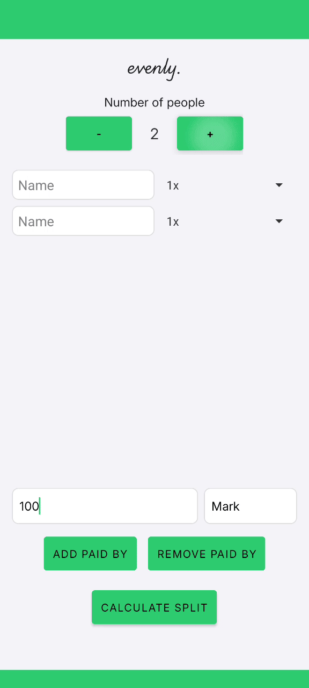

# 💶 evenly - Easy Bill Splitting 💶

This Android app provides a simple and intuitive way to split bills among multiple people.

**Features:**

- **Dynamic Person Count:** Easily adjust the number of people involved in the bill.
- **Individual Contributions:** Input the amount paid by each person, up to 3 payers.
- **Customizable Cut Sizes:** Assign different "cut sizes" (0.5x, 1x, 2x) to individuals based on their consumption or other factors.
- **Clear Results:** The app displays the final split as a list of who owes whom how much, making it easy to settle the bill. 

**How to Use:**

1. **Enter the Number of People:** Specify the number of people involved in the bill.
2. **Set Cut Sizes (Optional):** Adjust the cut size for each person to account for varying consumption or other factors.
3. **Input Paid Amounts:** Enter the amount paid by each person.
4. **Calculate Split:** The app will calculate the final split and display the results as a list of who owes whom how much.

## 🤳 Demo 🤳

